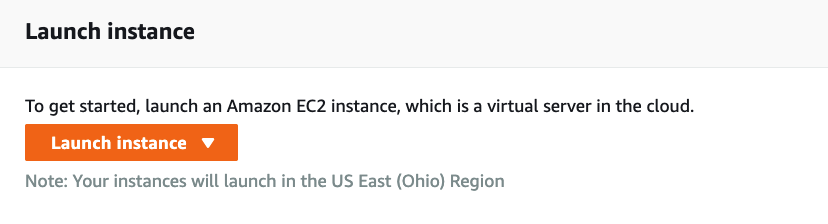
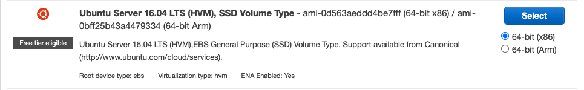
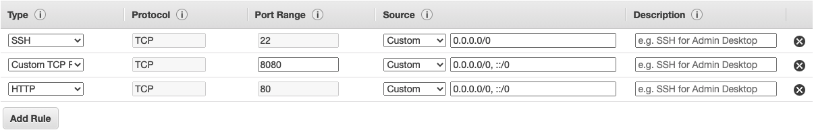
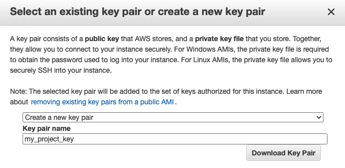

# A Digit Recognition Project
A full feature web app using MLP for digit recognition. You can register and create your own account to log in. After you log in, you can skected a digit on a jpeg format, and upload it. The application will analyze the picture and tell you what digit you sketched.

## 1. Structure of the project
## Front-end
- Bootstrap Studio
- Jinja2
## Databases
- PostgresSQL
- MongoDB
## Back-end
- Flask
## Deep Learning
- Tensorflow
- Pillow
- Numpy

##  2. Setup Development Server
### Create an EC2 instance 
1. You need to register an aws free account
2. Navigate to EC2 instances and click on launch instance
3. It is very important to make sure if you have a deep learning packages like **tensorflow** or **pytorch**, choose the *Deep Learning AMI*(Amazon Machine Images). Other wise, you will not be able to install those packages on your EC2 instance.
4. Choose an instance type, I chose free tier just for personal project.
5. Configure Instance Details, you don't really need to do anything for this step.
6. Add Storage, for free tier, 8 gig should be enough, so no need to make any changes.
7. Add tags, no action needed.
8. Configure Security Group, for this one, you need to add new rules for http request, postgres request. You can refer the screenshot below. 
9. Review Instance Launch. Click on the Launch button, you will be asked to select or create a key pair, after you create and name your key pair which is a .pem file. Download it and move it in your project root folder..
10. Click the launch button and you are all set.

### Connect to EC2 instance
1. Navigate to the folder where you keep your .pem file as the ec2 key pair
2. type `chmod 400 ` command in your terminal and drag your .pem file to the terminal. it should look like something lile this.\
 `chmod 400 /Users/yipengjiang/Learn/SFL\ demo/num_recog.pem`
3. Go to your ec2 terminal and click connect, copy the ssh clinet command and run it in your local terminal, then you can control your sever using ssh client. 

Attention:  When you stop and restart a instance, the public ip address and dns will change, so make sure you change your database configuration and whitelist.

### PostgresSQL container
1. To start your postgres docker container, make sure your have docker installed on your server, if not please refer to [docker offical documentation](https://www.walmart.com/registry/baby/c5dbbe58-62cc-4eed-b872-696496ac10ff).

2. In order to start your docker container, you have two options.
    1. Run this command in your terminal\
    `docker run -d --name <container_name> -p 5432:5432 -e POSTGRES_PASSWORD=1234 postgres`
    2. If you have install docker-compose on your EC2 instance, there is a yaml file which is a docker compose file. you can start your container simply by runing:\
    `docker-compose -f docker_compose.yaml up -d`
    
    *Remember* if there are multiple containers to run, it is easier to use docker-compose instead of writing individual running command on your terminal.
3. In order for local pgadmin to connect to the postgresSQL container on the cloud, we need to add a new security rule in the security group to enable postgresSQL TCP request.

4. Go to your pgadmin, click on create server
5. Fill your public EC2 instance address and your database password in the following window. 

### MongoDB Atlas
In order for the ec2 instance to connect to the mongoDB Atlas we need to whitelist our ec2 ip address in the mongodb terminal.

1. Go to cloud.mongodb.com to login in to your cluster
2. Navigate to *Network Acess* and click on ADD IP ADDRESS.
3. Go to your ec2 control panel, click on the instance and find your public Ip address. Remember the mongodb atlas free tier can not set up peering connection using private ip address. 
 

### TensorFlow2 on AWS DLAMI 
To activate TensorFlow 2, open an Amazon Elastic Compute Cloud (Amazon EC2) instance of the DLAMI with Conda.

1. For TensorFlow 2 and Keras 2 on Python 3 with CUDA 10.1 and MKL-DNN, run this command:\
`source activate tensorflow2_p36`

2. To Check virtual environments run:\
`conda info --envs`

### Install Required software and Packages
1. Before installing anything, make sure you do:\
`sudo apt update`.
1. Install **Python3** and **python3-pip** using\
 `sudo apt install python3.8 python3-pip `.
1. Install *python packages* using:\
`pip install -r requirements.txt`.
1. Install **nginx** web service software, once installed, you don't really need to configure anything.\
` sudo apt install nginx`
1. Last but not the least, Install gunicorn3,you can also install Flask_Gunicorn instead using pip. \
` sudo apt install gunicorn3` 

