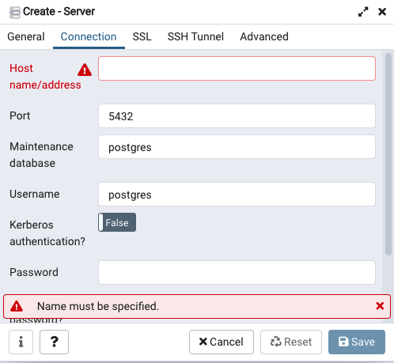

# A Digit Recognition Project
A full feature web app using MLP for digit recognition

## Connect to EC2 instance
1. Navigate to the folder where you keep your .pem file as the ec2 key pair
2. type `chmod 400 ` command in your terminal and drag your .pem file to the terminal. it should look like something lile this.\
 `chmod 400 /Users/yipengjiang/Learn/SFL\ demo/num_recog.pem`
3. Go to your ec2 terminal and click connect, copy the ssh clinet command and run it in your local terminal.

Attention:  When you stop and restart a instance, the public ip address and dns will change, so make sure you change your database configuration and whitelist.

## PostgresSQL container

1. In order for local pgadmin to connect to the postgresSQL container on the cloud, we need to add a new security rule in the security group to enable postgresSQL TCP request.

2. Go to your pgadmin, click on create server
3. Fill your public EC2 instance address and your database password in the following window. 

## MongoDB Atlas

In order for the ec2 instance to connect to the mongoDB Atlas we need to whitelist our ec2 ip address in the mongodb terminal.

1. Go to cloud.mongodb.com to login in to your cluster
2. Navigate to *Network Acess* and click on ADD IP ADDRESS.
3. Go to your ec2 control panel, click on the instance and find your public Ip address. Remember the mongodb atlas free tier can not set up peering connection using private ip address. 
 

## TensorFlow2 on AWS DLAMI 
To activate TensorFlow 2, open an Amazon Elastic Compute Cloud (Amazon EC2) instance of the DLAMI with Conda.

1. For TensorFlow 2 and Keras 2 on Python 3 with CUDA 10.1 and MKL-DNN, run this command:\
`source activate tensorflow2_p36`

2. To Check virtual environments run:\
`conda info --envs`

